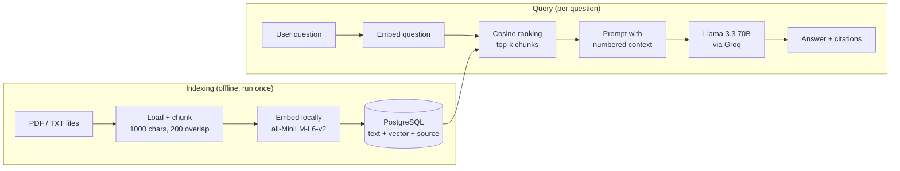

# RAG Chatbot over a Local Corpus, backed by PostgreSQL

[](https://github.com/Nejmeddin/Chatbot-RAG/actions/workflows/ci.yml)
[](https://www.python.org/downloads/)
[](LICENSE)

Ask questions in natural language about a folder of PDFs and text files, and get
answers **grounded in the documents, with the source of every claim cited**.

Embeddings are computed locally with a Hugging Face sentence-transformer and
stored in PostgreSQL, so the retrieval half of the pipeline costs nothing and
runs entirely on one laptop. Only the final generation step calls a hosted LLM.

The bundled corpus is [**Accueil_UBS**](http://www.info.univ-tours.fr/~antoine/parole_publique/):
43 documents of transcribed French spoken dialogue from a university reception
desk, plus its documentation.

---

## Demo

<!-- Replace the `ask` output below with a real transcript once you have run it
     against your own database and Groq key. -->

```console
$ python -m rag ingest
Prepared 201 chunks from data/
Inserted 201 new chunks (0 already indexed).
Total rows in 'documents': 201

$ python -m rag ask "Qu'est-ce que le corpus Accueil UBS ?"

Le corpus Accueil UBS est un corpus pilote de dialogue oral homme-machine
réalisé par le laboratoire VALORIA dans le cadre du projet AGILE-OURAL du
programme TECHNOLANGUE [1]. Il a ensuite été révisé au laboratoire LI dans le
cadre du projet régional ANCOR [1][2].

Sources:
  [1] Pres_Accueil_UBS.pdf p.2  (similarity 0.681)
  [2] Pres_Accueil_UBS.pdf p.3  (similarity 0.544)
```

Every claim carries the file and page it came from, so any answer can be checked
against the source. Running `ingest` a second time inserts nothing — indexing is
idempotent.

> **Add a screenshot here.** Run `streamlit run app.py`, ask a question, expand
> the *Sources* panel, and drop the image in as `docs/screenshot.png`. A picture
> of the working UI is the single highest-value thing you can add to this page.

---

## Architecture



---

## Quickstart

**Prerequisites:** Python 3.12+, a running PostgreSQL instance, and a free
[Groq API key](https://console.groq.com/keys).

```bash
# 1. Install
git clone https://github.com/Nejmeddin/Chatbot-RAG.git
cd Chatbot-RAG
python -m venv .venv && source .venv/bin/activate   # Windows: .venv\Scripts\activate
pip install -r requirements.txt

# 2. Configure
cp .env.example .env        # then edit .env with your DB password and Groq key
createdb rag_chatbot        # if the database does not exist yet

# 3. Index the documents (creates the table on first run)
python -m rag ingest

# 4. Ask
python -m rag ask "Qu'est-ce que le corpus Accueil UBS ?"
python -m rag chat          # interactive session
streamlit run app.py        # web UI
```

### CLI reference

| Command | What it does |
| --- | --- |
| `python -m rag ingest` | Load, chunk, embed and store everything in `data/` |
| `python -m rag ingest --reset` | Same, but empty the table first |
| `python -m rag ask "question"` | Answer one question and exit |
| `python -m rag chat` | Interactive question/answer loop |
| `python -m rag stats` | Show how many chunks and sources are indexed |
| `-v` | Add progress logging to any command |

All behaviour is configured through `.env` — chunk size, `top_k`, model names
and database connection. No value is hard-coded in the source.

---

## Design decisions

The assignment specified a particular architecture. These are the places where
I deviated, and why:

| Decision | Reasoning |
| --- | --- |
| **Local sentence-transformer** instead of a paid embedding API | `all-MiniLM-L6-v2` is 80MB, runs on CPU, and makes the project free to run and reproduce. |
| **`DOUBLE PRECISION[]`** instead of `pgvector` | Works on a stock PostgreSQL install with no extension to compile — see the trade-off below. |
| **Vectors normalised on write** | For unit vectors, cosine similarity *is* the dot product, so ranking is one matrix multiply and the project needs no similarity library. |
| **`pypdf` directly** instead of LangChain's document loaders | Three fewer dependencies, and it keeps per-page metadata that the loaders discard. |
| **Provenance stored per chunk** | Source file, page and position live in the table, which is what makes citations possible. |
| **Content-hash unique index** | Re-running ingestion is idempotent instead of duplicating the whole corpus. |

### The scaling trade-off, stated honestly

Storing embeddings in an array column means there is no vector index, so every
query loads the corpus and scores all `n` chunks: retrieval is **O(n) per
query**. At this project's scale (201 chunks, 384 dimensions) that is roughly a
0.1 MB matrix multiply — far below the latency of the LLM call, and the corpus
is cached in memory after the first query.

That stops being true somewhere around 10<sup>4</sup>–10<sup>5</sup> chunks. The
fix is not a cleverer scan; it is a `pgvector` column with an HNSW index, which
turns the linear scan into a sublinear index lookup and pushes the ranking into
the database instead of Python. `DocumentStore` is the only class that would
change.

---

## Project structure

```text
.
├── src/rag/
│   ├── config.py        Settings, read from .env - no secrets in source
│   ├── ingest.py        Load PDFs/TXTs, chunk them, keep provenance
│   ├── embeddings.py    Local sentence-transformer, L2-normalised output
│   ├── store.py         PostgreSQL schema, idempotent writes, corpus reads
│   ├── retriever.py     Cosine ranking, top-k selection
│   ├── chat.py          Prompt construction and grounded answers
│   ├── pipeline.py      Wires the components together from config
│   └── cli.py           ingest / ask / chat / stats
├── app.py               Streamlit web UI
├── tests/               33 tests, no database or model download needed
├── notebook/            The original exploration that led to src/rag/
├── data/                The document corpus
└── .env.example         Configuration template
```

---

## Testing

```bash
pip install pytest ruff
pytest              # 33 tests
ruff check src tests
```

The embedding model and the database are stubbed in the tests, so the suite
needs neither a PyTorch download nor a running PostgreSQL — it finishes in about
a second and runs unchanged in CI.

---

## Limitations and next steps

- **Retrieval is linear** in corpus size — see the trade-off above. Migrating
  `store.py` to `pgvector` + HNSW is the first thing I would do next.
- **Retrieval is purely semantic.** Exact identifiers and rare proper nouns
  would be better served by hybrid search (BM25 combined with vector scores).
- **No conversational memory.** Each question is answered independently;
  follow-ups like *"and what about the second one?"* will not resolve.
- **No answer-quality evaluation.** A small labelled question set scored for
  retrieval hit-rate and faithfulness would make changes measurable rather than
  vibes-based.
- **`.doc` / `.odt` / `.xml` files in `data/` are skipped** — only `.pdf` and
  `.txt` are indexed. The XML transcriptions carry speaker turns and timing that
  a dedicated loader could exploit.

---

## Author

**Nejmeddine Ben Maatoug** — ENIS (École Nationale d'Ingénieurs de Sfax)

Licensed under the [MIT License](LICENSE).
